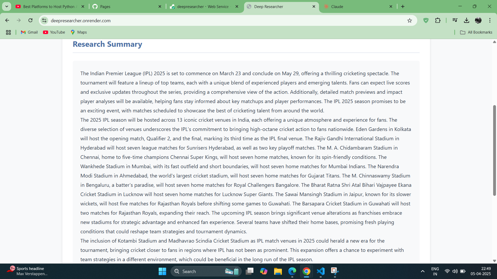
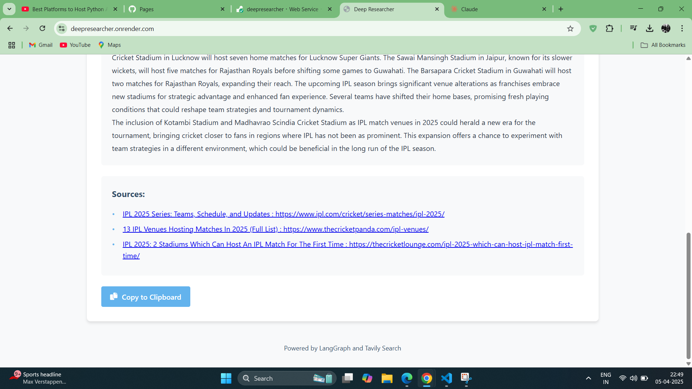

# Deep Researcher


A powerful web application that generates comprehensive research summaries by combining AI with web search capabilities. Deep Researcher uses LangGraph for orchestrating multi-step research flows and Tavily API for retrieving relevant web content.

🔗 **Live Demo**: [https://deepresearcher.onrender.com](https://deepresearcher.onrender.com)

## 📸 Screenshots

<div style="display: flex; justify-content: space-between; margin-bottom: 20px;">
  
  
  
</div>

## 🌟 Features

- **Intelligent Web Research**: Automatically generates targeted search queries based on your research topic
- **Multi-step Research Process**: Conducts multiple search iterations to gather comprehensive information
- **Progressive Refinement**: Each search iteration builds on previous findings to fill knowledge gaps
- **Real-time Progress Tracking**: Visual progress bar shows research completion status
- **Clean, Modern UI**: Intuitive interface with responsive design
- **Result Caching**: Stores research results to avoid redundant processing for repeated topics
- **Source Attribution**: Includes links to original sources for all research findings

## 🏗️ Architecture

Deep Researcher is built on tech stack:

- **Backend**:
  - Flask web server
  - LangGraph for orchestrating the research workflow
  - Groq API for LLM inference
  - Tavily API for web search capabilities
  - Multithreaded research processing

- **Frontend**:
  - HTML5, CSS3, and JavaScript
  - Responsive design that works on desktop and mobile
  - Real-time progress updates with Server-Sent Events

## 🧠 Research Workflow

1. **Query Generation**: The system creates targeted search queries based on your research topic
2. **Web Research**: Retrieves relevant information from the web using Tavily
3. **Summarization**: Summarizes gathered information into a coherent narrative
4. **Knowledge Gap Analysis**: Identifies missing information and generates follow-up queries
5. **Iterative Research**: Repeats the process to fill knowledge gaps (configurable number of iterations)
6. **Final Summary**: Compiles all research into a comprehensive summary with sources

## 🚀 Getting Started

### Prerequisites

- Python 3.7+
- API keys for:
  - Tavily
  - Groq

### Installation

1. Clone the repository:
   ```bash
   git clone https://github.com/yourusername/deep-researcher.git
   cd deep-researcher
   ```

2. Install dependencies:
   ```bash
   pip install -r requirements.txt
   ```

3. Set up environment variables:
   ```bash
   # Create a .env file in the project root with your API keys
   TAVILY_API_KEY = "your_tavily_api_key"
   GROQ_API_KEY = "your_groq_api_key"
   ```

### Running the Application

Start the Flask server:
```bash
python app.py
```

The application will be available at `http://localhost:5000`

### Deployment

The application is currently deployed on Render at [https://deepresearcher.onrender.com](https://deepresearcher.onrender.com).

To deploy your own instance:
1. Create an account on [Render](https://render.com)
2. Create a new Web Service
3. Connect your GitHub repository
4. Add your environment variables (API keys)
5. Deploy!

## 🔧 Configuration

You can customize the research process by modifying the following parameters in `groq_app.py`:

- `max_web_research_loops`: Number of research iterations (default: 3)
- `max_results`: Number of search results to retrieve per query (default: 3)
- `max_tokens_per_source`: Maximum tokens to include from each source (default: 1000)

## 📋 Usage

1. Enter your research topic in the input field
2. Click "Generate Research"
3. Wait for the research process to complete (typically 1-2 minutes)
4. Review the comprehensive summary and sources
5. Use the "Copy to Clipboard" button to save your results

## 🧩 Code Structure

- `app.py`: Flask server and main application logic
- `groq_app.py`: LangGraph workflow implementation
- `configuration.py`: Configuration settings
- `templates/`: HTML templates
- `static/`: CSS and JavaScript files
- `img/`: Screenshot images for documentation

## 🙏 Acknowledgments

- [LangGraph](https://github.com/langchain-ai/langgraph) for the workflow orchestration framework
- [Tavily](https://tavily.com/) for the search API
- [Groq](https://groq.ai/) for the fast LLM inference
- [Render](https://render.com/) for hosting the application
